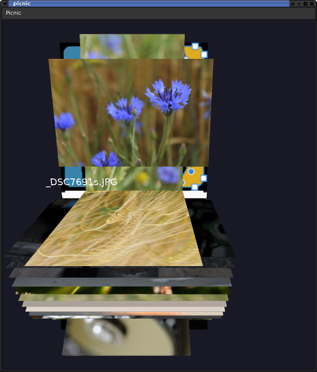
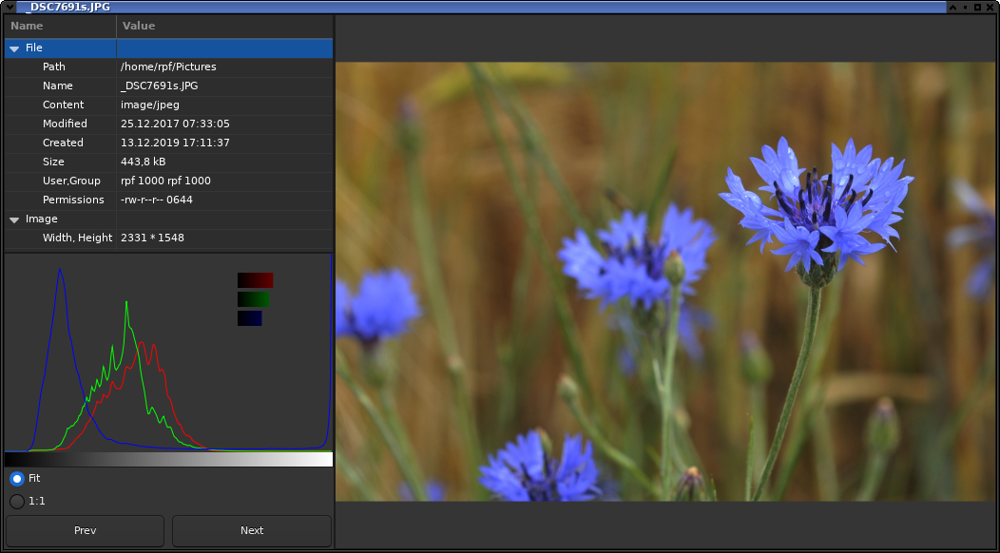

# picnic

A picture viewer allows you to flip (or better roll) thru your images by using OpenGL, thumbnail services and Dbus.
Allows cropping a image, and saving in formats supported by Gdk/Gtk.

Build with autotools, requires genericGlm and genericImg (see there for some basic build infos).

By no means that is intended to be complete, or help you to go thru anything more than a hundred pictures.

Enjoy it, you may improve it, or leave it.

With configure the following option is supported:
<pre>
     allow --with-gles using GL ES 3 e.g. useful on Raspi's
</pre>

Developer info:

to regenerate the interface if you feel this may be needed the following might be helpful:

As the interface appears to be stable (and requires the install of some  utilities) the generated sources have been included see ./gen

The process of rengenerate the .xml Interface description requires: `gdbus` which comes with the glib package (at least for my system).

The cpp sources are build with: `gdbus-codegen-glibmm3` which seems to be not part of a distribution.
So you have to clone https://github.com/Pelagicore/gdbus-codegen-glibmm ensure the python dependencies are available e.g. python-setuptools, ...

As root use:
<pre>
    python3 setup.py install --record egg-files.txt
</pre>

This allows a uninstall with:
<pre>
  cat egg-files.txt | rm -rf
</pre>
The rest will be handled with make.
